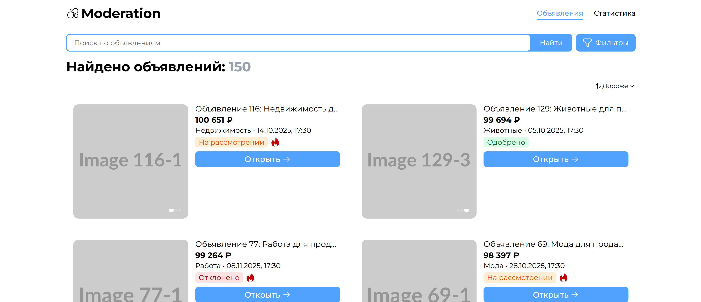
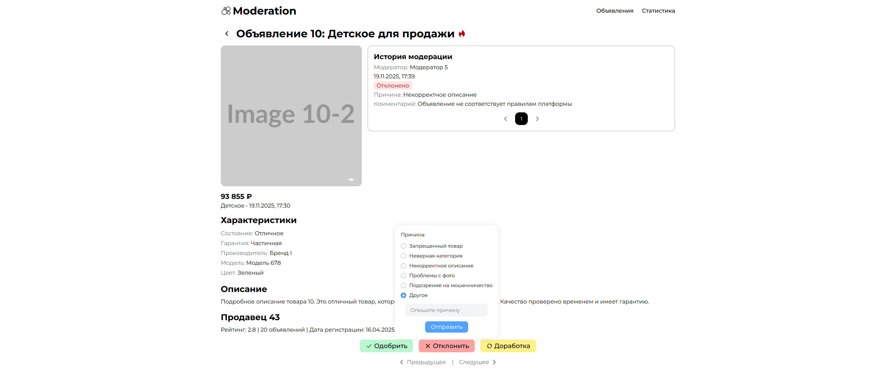
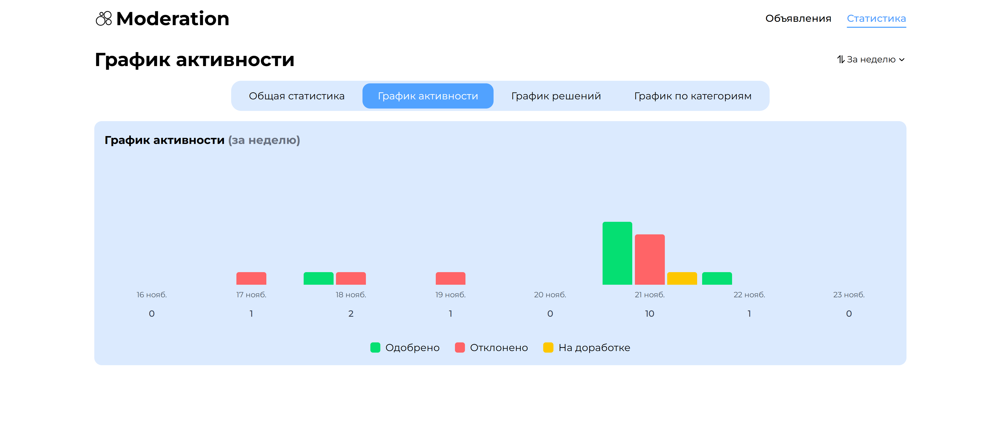
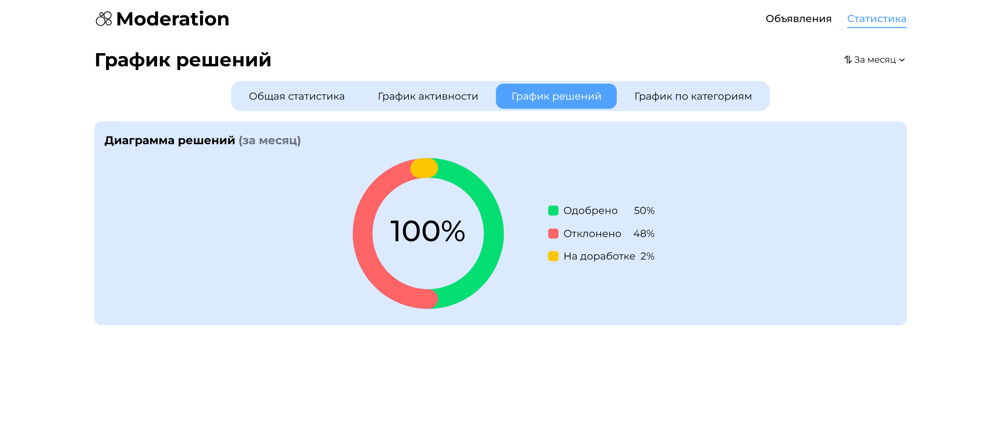

# 🛡️ Announcement Moderation - Система модерации объявлений

<div align="center">

**Современная платформа для эффективной модерации пользовательских объявлений**

[Особенности](#-особенности) • [Технологии](#-технологии) • [Демо](#-демо) • [Установка](#-установка) • [Контакты](#-контакты)

</div>

## 🚀 Особенности

### 🎯 Основной функционал

- **📋 Панель модерации** - Удобный просмотр всех объявлений с детальной информацией
- **⚡ Быстрые действия** - Одобрение, отклонение или доработка объявлений в один клик
- **📊 История модерации** - Полное отслеживание всех действий модератора для каждого объявления
- **🏷️ Система статусов** - Поддержка различных состояний модерации
- **🔍 Фильтрация** - Фильтрация объявлений по названию, статусам, цене и категориям
- **💾 Автосохранение** - Сохранение состояния в локальном хранилище

### ⚡ Технические преимущества

- **⚡ Высокая производительность** - Оптимизированная работа с большими объемами данных
- **🎨 Современный UI** - Чистый и интуитивный интерфейс на Tailwind CSS
- **📊 TypeScript** - Полная типобезопасность и надежность кода
- **🔄 Управление состоянием** - Централизованное управление через Redux Toolkit
- **📱 Адаптивный дизайн** - Идеальное отображение на всех устройствах

## 🛠 Технологии

<div align="center">

| Технология        | Назначение            | Версия |
| ----------------- | --------------------- | ------ |
| **React**         | Библиотека UI         | 19.2.0 |
| **TypeScript**    | Типизация             | 5.9.3  |
| **Redux Toolkit** | Управление состоянием | 2.10.1 |
| **Tailwind CSS**  | Стилизация            | 4.1.17 |
| **Vite**          | Сборка и разработка   | 7.2.2  |

</div>

### 🔧 Дополнительные технологии

- **React Router DOM** - Навигация между страницами
- **Redux Remember** - Сохранение состояния в localStorage
- **Axios** - HTTP-клиент для работы с API

## 🎨 Демо

### 📸 Скриншоты интерфейса

##### 📋 Главная экран и список объявлений → ⚡ Детали объявления → 📊 Статистика

<div align="center">
Главная экран и список объявлений

<div style="display: flex; justify-content: center; gap: 10px; margin: 20px 0;">   </div>
Детали объявления

<div style="display: flex; justify-content: center; gap: 10px; margin: 20px 0;">   </div>
Статистика

<div style="display: flex; justify-content: center; margin: 20px 0;">  </div></div>

### 🎯 Ключевые экраны

- **Список объявлений `/list`** - Страница с карточками объявлений с фильтрацией и поиском
- **Детали объявления `/item/:id`** - Полная информация для принятия решения
- **Статистика `/stats`** - Аналитика и метрики модерации

## 🚀 Установка и запуск

### 📥 Установка

```bash
# Клонирование репозитория
git clone https://github.com/ArtemH2004/announcement-moderation.git
cd announcement-moderation

# Установка зависимостей
npm install
# или
yarn install
# или
pnpm install
```

### 🏃 Запуск приложения

```bash
# Режим разработки
npm run dev
# или
yarn dev
# или
pnpm dev
```

Приложение будет доступно по адресу: http://localhost:5173

### 📁 Структура проекта

```text
announcement-moderation/
├── node_modules/          # Зависимости проекта
├── public/                # Статические файлы
├── src/
│   ├── api/              # API сервисы и HTTP-запросы
│   ├── common/           # Общие модули
│   |   ├── components/   # React компоненты
│   |   ├── enums/        # Перечисления TypeScript
│   |   ├── helpers/      # Вспомогательные функции
│   |   ├── hooks/        # Кастомные хуки React
│   |   └── styles/       # Стили и CSS
│   ├── pages/            # Страницы приложения
│   │   ├── item/         # Страница объявления
│   │   ├── list/         # Список объявлений
│   │   └── stats/        # Статистика
│   ├── router/           # Навигация и маршрутизация
│   ├── store/            # Redux хранилища состояния
│   │   ├── reducers/     # Редюсеры
│   │   ├── actions.ts    # Экшены
│   │   └── store.ts      # Конфигурация store
│   ├── App.tsx           # Корневой компонент
│   └── main.tsx          # Точка входа
├── .gitignore            # Git ignore правила
├── eslint.config.js      # Конфигурация ESLint
├── index.html            # HTML шаблон
├── package.json          # Зависимости и скрипты проекта
├── package-lock.json     # Лок файл зависимостей
├── README.md             # Основная документация
├── tsconfig.app.json     # Конфигурация TypeScript для приложения
├── tsconfig.json         # Основная конфигурация TypeScript
├── tsconfig.node.json    # Конфигурация TypeScript для Node.js
└── vite.config.ts        # Конфигурация Vite
```

### 🎯 Основные компоненты

#### 🛡️ Moderation System

```text
List.tsx - Страница списка объявлений

Item.tsx - Страница объявления

Stats.tsx - Станица статистики модерации по категориям
```

#### 📊 Dashboard & Analytics

```text
StatsList - Панель общей статистики

StatsActivity - Панель графика активности

StatsCircleDiagram - Панель графика решений

StatsActivity - Панель графика по категориям

StatsCategoriesList - Очередь объявлений на модерацию
```

#### 🎪 UI Components

```text
Button - Универсальный компонент кнопки

Dropdown - Модальные окна для различных действий

Toggle - Переключатель секций статистики

Pagination - Пагинация для больших списков
```

### 🔧 Разработка

#### 🏗 Архитектура проекта

Проект построен по принципам Feature-Sliced Design с четким разделением ответственности:

- **Components** - Переиспользуемые UI компоненты

- **Pages** - Страницы приложения

- **Store** - Управление состоянием через Redux Toolkit

- **Hooks** - Кастомные хуки для бизнес-логики

### 📞 Контакты

#### 👨‍💻 Автор проекта

Артем - Frontend Developer
https://t.me/artemh2004
